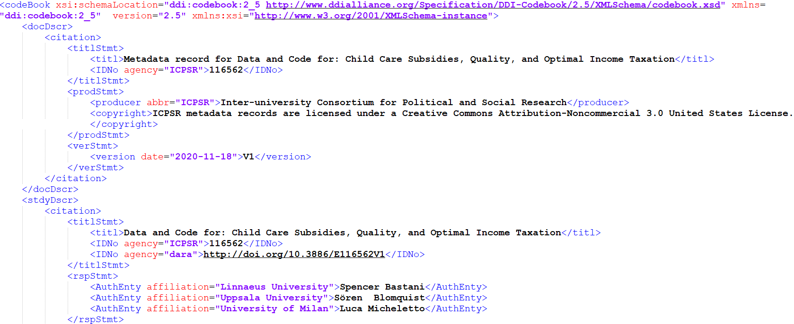

# Metadata in practice

It is good practice to structure metadata using standardized schemas, standards, and formats created and maintained by research communities.

>“In order to be useful, metadata needs to be standardized. This includes agreeing on language, spelling, date format, etc.” ([UNC Metadata for Data Management](https://guides.lib.unc.edu/metadata/standards))

Getting the metadata schema and standards within set-up at the beginning of the project is very important in ensuring future usability. You should also consider the type of resources you’re creating, and what can be understood from them (or not).
* If a textual resource has all or most the information on or within it (e.g. names, dates, etc.), a user may be able to understand the resource or relatively well. If you’re depositing the research to a repository, it’s also more likely that some metadata can be created from this information within the resources.
* If the content is non-textual or requires additional context (e.g. images, multimedia, datasets), it can be difficult for a user to understand and use the resource.  If you’re depositing to a repository, there’s not much the repository can do to create that metadata, and as a result the content may not be usable or cannot be accepted. Other aspects, such as language of the resource vs. the primary language of the repository, should also be considered.

Additionally, sometimes it makes sense to create free text “readme” style metadata. In the research context, readme files are often used to document information before being transferred to a more standardized format, or if no appropriate standard exists. It also provides instructions and context to understand and use resources such as datasets.

Metadata can be generated as part of an automated process, or be created manually. Research projects often involve a mix of both, depending on the content and destined platforms for deposit.

It’s highly recommended that at the beginning of your research project, you think about where your research will be stored and made accessible. If it’s destined for something like a repository, there are considerations that should be taken in both content and metadata creation. The purpose of the research can help determine what metadata is necessary for understanding and reproducibility.

## Metadata schemas and standards
What are metadata schemas and standards? Communities create, manage, and use different types of information and resources in different ways. Within and across communities, there needs to be some consistency in order for the metadata to be understandable (by both people and machines) ([University of Texas Libraries](https://guides.lib.utexas.edu/metadata-basics/standards)).

A metadata schema establishes a common way of structuring the metadata, and includes a list of elements (fields) that describe the resources.
* Elements could be Title, Identifier, Creator name(s), Date(s), etc.

Standards provide guidance in how to populate elements within a schema.
* What pieces of information goes where?  
* How should the information be formatted (e.g. dates, names)?
* Are there standardized terms (e.g. controlled vocabulary, thesauri) that should be used to populate an element?

Research projects or databases can adapt one or more schemas and/or standards, and then create a custom schema based on those chosen.

Custom elements can be necessary to meet the needs of the research project, though one must understand that the project schema may not be able to translate in that exact way in another platform/system (e.g. repository deposit).
{: .note}

There are many types of metadata schemas, varying in audience, complexity, and specificity (disciplinary vs. interdisciplinary). Generic schemas may be easier to use and thus more widely adopted, but can lack coverage for specific types of information. Some disciplines have established metadata standards with specific vocabulary and structure to meet the needs of that research area. In addition, some data repositories have their own schema and standards.

Some common schemas and their disciplines include (but are not limited to):

| Schema                              | Discipline(s)                                                 |
|:-------------------------------------|:--------------------------------------------------------------|
| [Dublin Core (DC)](https://www.dublincore.org/specifications/dublin-core/dcmi-terms/)                    | Interdisciplinary (general, basic, and widely used)          |
| [DataCite](https://schema.datacite.org/)                            | Used for creating DOIs (unique identifiers)              |
| [Data Documentation Initiative (DDI)](http://www.ddialliance.org/) | Social, behavioral, and economic sciences                    |
| [Darwin Core (DwC)](http://rs.tdwg.org/dwc/)                   | Biological sciences                                          |
| [ISO 19115](http://www.iso.org/iso/catalogue_detail.htm?csnumber=53798)                           | International standard for geospatial information            |
| [MAchine-Readable Cataloging (MARC)](https://www.loc.gov/marc/)  | Bibliographic and authority information                      |
| [Text Encoding Initiative (TEI)](https://tei-c.org/)      | Machine readable creative and interpretive representation of texts or manuscripts |
| [Music Encoding Initative (MEI)](https://music-encoding.org/)      | Machine readable representation of music                     |

Dublin Core (DC) example ([cIRcle @ UBC Library](http://hdl.handle.net/2429/76411))

* Here’s a screenshot from cIRcle (UBC’s digital repository; these screenshots are from the back-end repository platform so you can see the schema elements, but presents a bit differently publicly). It uses the Dublin Core schema with selected elements (some of which are repeatable, some of which use controlled vocabulary). The elements are flexible for the variety of content held by the repository.

Data Documentation Initiative (DDI) example ([ICPSR](https://www.openicpsr.org/openicpsr/project/116562/version/V1/view;jsessionid=507E1914F18B7353C7EE776D4B248030))

* Here’s a screenshot from the Inter-university Consortium for Political and Social Research (ICPSR), which is a data archive for the social sciences. It uses the DDI schema, expressed here in XML (XML is commonly used to store and share metadata, because it’s both human and machine readable). It’s a bit more complex with hierarchies and element attributes.

ISO 19115 example ([U.S. Geological Survey](https://www.sciencebase.gov/catalog/file/get/59f8af92e4b063d5d309f043?name=USGS_BBLEH_2012.xml&allowOpen=true))

* Here’s a screenshot from the U.S. Geological Survey. It uses ISO 19115, also expressed here in XML, and you can see it’s hierarchical as well. There are relationships between the elements that become apparent when you see how they are nested. Additionally, some elements can be repeated in different contexts.

## More on metadata schemas and standards

As we’ve seen with some examples, metadata schemas can be relatively simple (e.g. Dublin Core) or more complex with hierarchies and repeatable fields (e.g. ISO 19115). This standardized metadata is typically stored in file formats like xml, json, csv. There are also software tools that can be used to create metadata that adheres to a given standard, or express it in a given file format.

Many databases and platforms allow for metadata export in other schemas and formats, which facilitate interoperability and sharing. So standardization is very important to permit this compatibility.
* Crosswalking is the process of translating elements from one metadata schema to another. This facilitates and allows interoperability and harvesting across multiple platforms and systems, increasing research discovery and use. For example, crosswalking metadata facilitates record harvest from Canadian repositories to Canada’s [Federated Research Data Repository (FRDR)](https://www.frdr-dfdr.ca).

## Which metadata schema is right for my project or resources?

Schema can vary in their complexity:

<table>
<tr>
<th>Benefits of basic standards (e.g. Dublin Core; DataCite)</th>
<th>Benefits of complex standards (e.g. DDI; ISO 19115)</th>
</tr>
<tr>
<td>
<ul>
<li>Accessible and easy to interpret</li>
<li>Interoperable (can be applied to a wide range of resources and used in a wide range of settings)</li>
<li>Easy and quick metadata creation</li>
</ul>
</td>
<td>
<ul><li>Comprehensive description</li>
<li>Potentially for increased discoverability</li>
<li>Specific to subject area</li>
</ul>
</td>
</tr>
</table>

Generally, you should be able to find a metadata schema that suits your research. Discuss with colleagues in your research area or those who are doing similar work; they may be able to guide you to preferred standards (and share any lessons learned). Keep the user’s perspective in mind - it should make sense for your intended users.

Having a metadata schema with standards set-up at the beginning of the project, agreement on those standards, and known responsibility/accountability in the project team is very important. You should take into consideration what the end goals of the project are. Certain kinds of metadata analysis and manipulation will require metadata to be input in a standardized way. Consistent entry at an appropriate level of detail for varying uses is important.

## More on metadata in practice
It’s important to consider the *accuracy*, *completeness*, *consistency*, and *interoperability* of your metadata, all of which will affect its future discovery and use.

If you’re planning to deposit your research to a UBC Library repository, it’s highly recommended you connect with the unit at the beginning of your project, so we can provide guidance in schema, standards, and preparing your research for submission.

* [UBC Dataverse](https://dataverse.scholarsportal.info/dataverse/ubc): UBC’s research data repository for UBC faculty, students and staff.
* [cIRcle, UBC’s digital repository](http://circle.ubc.ca/): UBC's open access digital repository for published and unpublished material created by the UBC community and its partners.

Other units at the Library may be consulted, depending on the needs and nature of the project. Your [Subject Librarian] (https://directory.library.ubc.ca/subjectlibrarians/) may also be able to provide guidance on metadata schemas used in your field.

## Resources
* [Digital Curation Centre (DCC)’s list of metadata standards](https://www.dcc.ac.uk/guidance/standards/metadata)
* [RDA Metadata Standards Directory Working Group (includes descriptions, implementation tools, and use cases)](http://rd-alliance.github.io/metadata-directory/)
* [Seeing Standards: A Visualization of the Metadata Universe](http://jennriley.com/metadatamap/seeingstandards.pdf)
