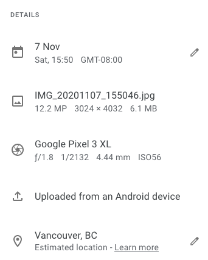

# Metadata Tools

Going back to different kinds of metadata. There are many tools that support metadata creation, management, and clean-up. Different forms of metadata creation and cleanup apply for different use cases. Some tools focus on the application of a metadata schema to a dataset and are arranged around the schema, some are focused on cleaning and articulating the nature of your data. Whether a tool is “metadata” relevant is vague as well. Metadata comes in many forms, is used to support many use cases, and the diversity of tools that may be useful to your work reflects this.

For example, metadata creation in the academy might look like a research group is working on a project with many different collaborators. Discipline specific metadata is important to help discoverability within a different communities of practice and automated project level metadata is important to help reflect the contribution of different team members.

Metadata outside of the academy might be structured to support how information is presented on a website. This could look like a filter that helps you locate a type of item while shopping online or a timestamp on a blog post.

Regardless of what kind of metadata your project is engaging with it needs to be clean and well organised. Tools for working with and cleaning metadata can help you attaining that.

## Creating basic metadata
Your best tool is a strong plan and policies around the creation of metadata that your team will follow. This begins with a well structures ReadMe file (a text file that describes your data and reasoning behind how it is organized) and a likely a codebook (a file that defines the fields that you are collecting). In a ReadMe file you might indicate which information is coming from tools that you are using and which is being collected manually. You may also want to note any important cleaning steps you took to augment the data collected and where a viewer of your work could learn more about your process.

While aimed at software development, the “[make a readme resource](https://www.makeareadme.com/)” is useful to explore as well as [readme guidance from UBC](https://researchdata-06oct2014.sites.olt.ubc.ca/files/2020/04/QuickGuide_UBC_readme_v1.0_20200427.pdf).
{: .note}

## Manual metadata creation

Manually creating metadata can be fraught but a few common functions can help you move along. Today, this is often done through the use of a digital tool though data collection can happed through analogue methods too.

At the simple end of the spectrum, a well formatted spreadsheet can get you far. Commons spreadsheet software such as Excel, LibreOffice, and Google Sheets have a number of built-in data formatting cleaning functions that can keep your information well organized.

Common functions that are useful to have in your back pocket are:
* “CONCAT” which merges pieces or sections of data
* “SPLIT” which separates a piece of data into multiple pieces
* “CROSSTAB”which shows the relationship between variables

For a comprehensive list of functions and how they work:
* [Excel docs](https://support.microsoft.com/en-us/office/excel-functions-by-category-5f91f4e9-7b42-46d2-9bd1-63f26a86c0eb)
* [LibreOffice docs](https://help.libreoffice.org/Calc/Functions_by_Category)
* [Google Sheet docs](https://support.google.com/docs/table/25273?hl=en)

Note that the three spreadsheet tools listed above all recognise similar functions but the exact structure might vary.
{: .note}

Beyond spreadsheet software the humble text editor is a useful tool to have in your arsenal. A good text editor that can work across multiple operating systems and is free to use is [Atom](https://atom.io/). Other good options are Sublime (there is a free variant) which is also operating system agnostic, Notepad++ for PCs, and TextWrangler for Macs. Most modern text editors have a built in Regex (sometimes called GREP) function in the find and replace which can be really helpful for normalising spelling or formatting across a text file. The find and replace feature in most text editors can also accept unicode characters which is helpful when editing based on a specific type of character.

Sometimes the metadata we are working with is in a format that might be a bit challenging to open or edit. This is particularly the case when metadata is automatically generated into something like XML (extensible markup language) which is both machine and human readable. XML is an example of a format that benefits from a type specific editor such as Oxygen which allows you to manipulate XML with a bit more control.

### Schema specific editors and metadata collections

Many standards maintain their own list of tools to aide implementation. To find a tool for your disciplinary use case take a look at the [RDA (Research Data Alliance) Metadata Directory for a list](http://rd-alliance.github.io/metadata-directory/.

To find a schema-specific metadata tool relevant to your work, take a look at this helpful [comparison chart from Stanford](https://library.stanford.edu/research/data-management-services/data-best-practices/creating-metadata/metadata-tools-comparison).

### Editing automated embedded metadata

When you take a photo with your phone and open it on your computer you can already see a lot of information about it by default. Things like location, the time it was taken, and which device took it. This is Exif metadata which is an example of automatically assigned metadata. It is usually structured along standards (eg. ISO time and date standards) and persistent in the image file regardless of where you move it.

That persistency doesn’t mean that you can’t edit it though. For our image example, Exif editors can change the time and date, providing false information. Generally speaking automatically generated metadata has a utility for later search functions and should be left alone. That said, one excellent reason that you may want to remove embedded automated metadata is over privacy concerns.

A great tool for working with Exif and other forms of metadata that are automatically embedded into files is [Exiftool](https://exiftool.org/).
{: .note}

## A note on cleaning data
Metadata is a type of data so many workflows that support us in

When working with any kind of data, particularly data that is manually entered, you may encounter issues with it that require cleaning.

For example, a dataset might have issues with any of the following:
* Encoding (eg. foreign characters to current settings)
* Rogue spaces and visual formatting
* Batched data that needs to be split
* Inconsistencies (eg. spelling, inconsistent language use)

It is particularly important to be consistent with the terms and format used in metadata because of the way in which metadata fields are used to support search, filtering, and other structures that allow your data to be discoverable and useable by others.

Simple fixes for common problems might involve using a different tool to open your data. For example opening a .csv (comma separated values) document in Excel might result in some odd data typing (eg. dates treated as numbers). Opening the same file in LibreOffice might be more effective as LibreOffice is less likely to try to make a best guess at date formatting for you. Similarly a tool might not be able to recognise a type of letter or accent in some of your data and saving from that tool might introduce unicode errors into your data.

Generally speaking when working with metadata it is important to work with open and flat formats such as text files (.txt, .csv, .tsv, .xml, .html) and use tools appropriate for working with those file formats.

### Regular Expressions

Beyond using the right tool for the job, it’s useful to be aware of Regular Expressions.

Regular expressions are a way of finding and working with phrase structures. Instead of a “find” function that looks for a word a regular expression can look for a sequence of characters. Eg. “find everything that starts with a digit”. Regex is built into modern programming languages and also in most text editors (eg. AtoM, Sublime, TextWrangler, and Notepad++) not as a find-and-replace feature. Regex is capable of searching for and splitting lines on unicode characters which can be particularly helpful when cleaning encoding errors.

Explore regular expressions online through [Regexr](https://regexr.com/).
{: .note}

OpenRefine: an open source software application originally developed by Google that allows for organization and clean up of large amounts of data. Similar to a spreadsheet but offers capability beyond software like Microsoft Excel. This added capability comes from the underlying architecture of Open Refine which makes use of GREL a regular-expression based language. Common functions for cleaning metadata in Open Refine are similar to what you might use in Excel such as CONCAT and SPLIT.

One benefit of Open Refine is that you can do API calls directly from it through the URL function when adding data. Open Refine is also able to read JSON as well as text content copy-pasted into the clipboard function which is one of the many ways that it goes beyond traditional spreadsheet software.

Learn more about Open Refine and what you can do with it: [https://librarycarpentry.org/lc-open-refine/](https://librarycarpentry.org/lc-open-refine/).
{: .note}

### Programmatic manipulation of data

R and Python and both programming languages with a suite of data cleaning and manipulation tools at your disposal. While this is beyond the scope of this workshop, these are useful tools to be aware of.

Learn more about the [R Tidyverse](https://www.tidyverse.org/) and [Python Pandas](https://pandas.pydata.org/).
{: .note}
